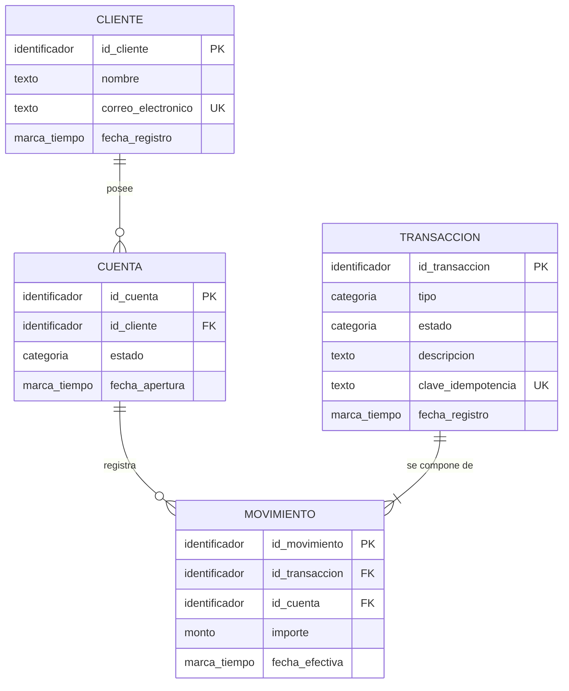

# Fase 1 — Modelo Conceptual

Sistema de gestión de transacciones financieras.

> **Alcance de este documento.** Un modelo conceptual describe *qué existe en el
> negocio y cómo se relaciona*. No define tipos de dato, longitudes, claves
> técnicas, índices ni motor de base de datos: todo eso pertenece a las Fases 2 y 3.
> Los "tipos" que aparecen en el diagrama (`identificador`, `monto`, `texto`,
> `marca_tiempo`, `categoria`) son descriptores conceptuales, no tipos SQL.

## Nota sobre el código base

El archivo `conceptual/modelo_conceptual.sql` que venía en el código base **no es
un modelo conceptual**: es DDL de PostgreSQL con `SERIAL`, `VARCHAR(100)` y
`DECIMAL(10,2)`. Su única diferencia con `logico/modelo_logico.sql` es sintáctica
(declara las claves foráneas con `ALTER TABLE` en vez de inline), lo cual no
constituye una diferencia de nivel de modelado. Se conserva en el repositorio como
insumo histórico; el entregable de la Fase 1 es este documento.

> **Nomenclatura.** Las entidades se nombran en español en este documento.
> La correspondencia con los nombres de tabla en inglés está en
> [`logico/modelo_logico.md`](../logico/modelo_logico.md#convención-de-nomenclatura).

---

## Diagrama entidad-relación

---

## Entidades

### CLIENTE
Persona o empresa titular de una o más cuentas en la entidad financiera.

| Atributo | Significado de negocio |
|---|---|
| `id_cliente` | Identifica al cliente de forma única. |
| `nombre` | Nombre o razón social. |
| `correo_electronico` | Canal de contacto. Único: no puede haber dos clientes con el mismo correo. |
| `fecha_registro` | Momento de alta en el sistema. |

### CUENTA
Contenedor de valor perteneciente a un cliente. Es la unidad sobre la que se calcula un saldo.

| Atributo | Significado de negocio |
|---|---|
| `id_cuenta` | Identifica la cuenta de forma única. |
| `id_cliente` | Cliente titular. |
| `estado` | Situación operativa: activa, bloqueada o cerrada. Determina si admite movimientos. |
| `fecha_apertura` | Momento de apertura. |

> **`saldo` no es un atributo de CUENTA.** El saldo es un valor *derivado*: la suma
> de los importes de los movimientos confirmados de la cuenta (regla R5).
> Almacenarlo como atributo duplicaría información ya contenida en MOVIMIENTO y
> abriría la posibilidad de que el saldo y el historial se contradigan.
> La decisión de *materializarlo* por rendimiento corresponde a la Fase 3.

### TRANSACCIÓN
Evento de negocio que desplaza valor: un depósito, un retiro, una transferencia.
Es la unidad que el cliente reconoce y que aparece descrita en su extracto.

| Atributo | Significado de negocio |
|---|---|
| `id_transaccion` | Identifica el evento de forma única. |
| `tipo` | Naturaleza del evento: depósito, retiro, transferencia, comisión, reverso. |
| `estado` | Situación del evento: pendiente, confirmada, rechazada, revertida. Solo las confirmadas afectan el saldo. |
| `descripcion` | Glosa legible para el cliente. |
| `clave_idempotencia` | Referencia única provista por el originador. Impide que un reintento de red registre el mismo evento dos veces. |
| `fecha_registro` | Momento en que el sistema recibió el evento. |

### MOVIMIENTO
Efecto individual de una transacción sobre una cuenta concreta. Es el asiento contable.

| Atributo | Significado de negocio |
|---|---|
| `id_movimiento` | Identifica el asiento de forma única. |
| `id_transaccion` | Evento que lo originó. |
| `id_cuenta` | Cuenta afectada. |
| `importe` | Valor con signo: negativo si sale de la cuenta, positivo si entra. |
| `fecha_efectiva` | Momento en que el movimiento impacta contablemente el saldo. Puede diferir de `fecha_registro` de la transacción. |

---

## Relaciones y cardinalidades

| Relación | Cardinalidad | Lectura |
|---|---|---|
| CLIENTE — CUENTA | 1 : 0..N | Un cliente posee cero o más cuentas. Toda cuenta pertenece a exactamente un cliente. |
| CUENTA — MOVIMIENTO | 1 : 0..N | Una cuenta registra cero o más movimientos. Todo movimiento afecta exactamente una cuenta. |
| TRANSACCION — MOVIMIENTO | 1 : 2..N | Una transacción se compone de **al menos dos** movimientos. Todo movimiento pertenece a exactamente una transacción. |

> La cardinalidad mínima de 2 en TRANSACCION — MOVIMIENTO es la expresión
> estructural de la partida doble: no existe un movimiento de valor que no tenga
> contrapartida. El diagrama Mermaid la representa como `1..N` porque su notación
> no distingue mínimos mayores que uno; la restricción real está en la regla R2.

---

## Reglas de negocio (invariantes)

| # | Regla | Por qué |
|---|---|---|
| **R1** | La suma de los importes de los movimientos de una transacción es siempre **cero**. | Es el invariante de la partida doble. Si la suma no da cero, se creó o destruyó valor: hay corrupción de datos. Verificable con una sola consulta sobre toda la base. |
| **R2** | Toda transacción tiene al menos dos movimientos. | Todo valor que sale de algún lado entra a otro. Un depósito externo tiene contrapartida en una cuenta interna de la entidad (caja, corresponsal). |
| **R3** | Un movimiento pertenece a exactamente una transacción y afecta exactamente una cuenta. | Mantiene la trazabilidad completa entre evento de negocio y efecto contable. |
| **R4** | Los movimientos son **inmutables**: no se modifican ni se eliminan. | Requisito de auditoría. Una corrección se expresa como una nueva transacción de reverso que genera movimientos opuestos, dejando ambos hechos en el historial. |
| **R5** | El saldo de una cuenta es la suma de los importes de sus movimientos cuya transacción está confirmada. | El saldo es consecuencia del historial, no un dato independiente que pueda divergir de él. |
| **R6** | Solo las cuentas en estado *activa* admiten nuevos movimientos. | Control operativo sobre cuentas bloqueadas o cerradas. |
| **R7** | Dos transacciones no pueden compartir la misma clave de idempotencia. | Un reintento por timeout de red no debe duplicar el movimiento de dinero. |

---

## Decisiones de alcance

Lo que este modelo **deja deliberadamente fuera**, y qué haría falta para incorporarlo:

### Multi-moneda
El modelo actual asume **una moneda única** para todo el sistema. Es una
simplificación consciente del reto, no una limitación estructural.

Para soportar varias monedas haría falta:

- Una entidad **MONEDA** (catálogo: código ISO 4217, número de decimales — el peso
  chileno tiene 0, el dinar kuwaití tiene 3).
- Un atributo `moneda` en **CUENTA**: cada cuenta opera en una sola moneda.
- Un atributo `moneda` en **MOVIMIENTO**, heredado de su cuenta.
- Una reformulación de **R1**: la suma cero debe verificarse *por moneda*, no
  globalmente. Sumar 100 USD con −380.000 COP no tiene sentido contable.
- Para transacciones con conversión (FX), una entidad **TASA_DE_CAMBIO** y dos
  movimientos adicionales contra una cuenta de posición de cambio, de modo que
  cada moneda cuadre por separado dentro de la misma transacción.

La estructura de partida doble absorbe todo esto **sin cambiar las entidades
existentes ni sus relaciones**, que es justamente su ventaja frente a un modelo de
cuenta origen/destino.

### Otras exclusiones

| Fuera de alcance | Qué implicaría |
|---|---|
| Cuentas mancomunadas (varios titulares) | Convertir CLIENTE — CUENTA en N:M con una entidad de titularidad y su rol. |
| Tipos y productos de cuenta (ahorros, corriente, crédito) | Entidad de catálogo PRODUCTO con sus reglas (sobregiro permitido, tasa). |
| Contrapartes externas (otros bancos, comercios) | Entidad CONTRAPARTE referenciada desde TRANSACCION. |
| Límites y cupos transaccionales | Entidad de políticas con ventanas temporales acumuladas. |
| Auditoría de cambios sobre CLIENTE y CUENTA | Tablas de historial temporal (los movimientos ya son inmutables por R4). |
