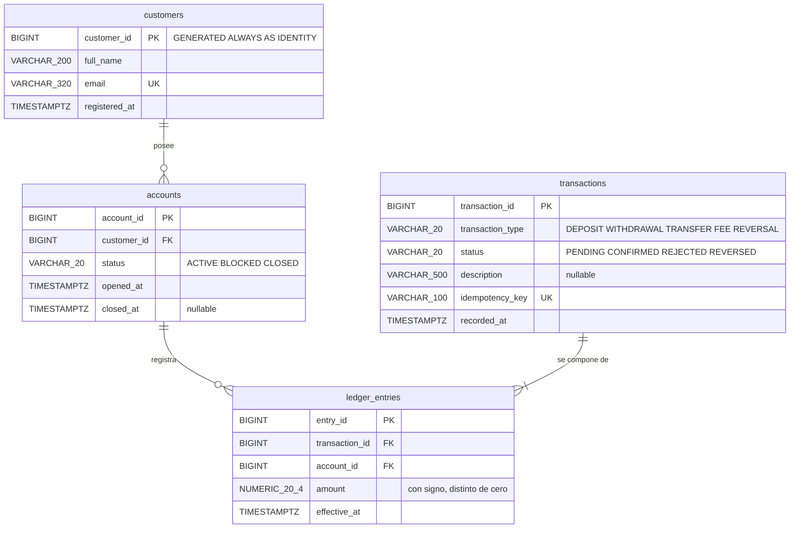

# Fase 2 — Modelo Lógico

Transformación del modelo conceptual (Fase 1) a estructuras relacionales.

> **Límite de esta fase.** El modelo lógico define *qué tablas existen, con qué
> columnas, tipos y restricciones*. No define índices, particiones, parámetros de
> almacenamiento ni estrategia de escalado: eso es Fase 3. Se usa SQL estándar
> salvo donde se indique explícitamente.

Entregables: `modelo_logico.sql` (DDL) y `pruebas_modelo_logico.sql` (verificación
de las reglas de negocio).

---

## Convención de nomenclatura

Identificadores de base de datos en **inglés**, `snake_case`, tablas en plural.
Documentación y diagramas en **español**.

| Entidad conceptual (ES) | Tabla (EN) | Por qué |
|---|---|---|
| CLIENTE | `customers` | |
| CUENTA | `accounts` | |
| TRANSACCIÓN | `transactions` | |
| MOVIMIENTO | `ledger_entries` | "Asiento del libro mayor" es el término contable estándar; `movements` sería ambiguo. |

> El código base usaba `PascalCase` (`Transactions`, `AccountID`). PostgreSQL
> pliega a minúsculas todo identificador no entrecomillado, así que ese
> `PascalCase` **no existía en la base**: las tablas realmente se llamaban
> `transactions` y `accountid`. Escribir `snake_case` explícito elimina la
> discrepancia entre lo que se escribe y lo que el motor almacena.

---

## Diagrama del modelo lógico



---

## Decisiones de tipo de dato

Cada fila corrige un problema concreto del código base.

| Código base | Modelo lógico | Razón |
|---|---|---|
| `SERIAL` | `BIGINT GENERATED ALWAYS AS IDENTITY` | `SERIAL` es una extensión propietaria de PostgreSQL, no SQL estándar, y la documentación oficial recomienda `IDENTITY` desde PG10. Además `GENERATED ALWAYS` **impide** insertar un valor explícito; con `SERIAL` se puede, y eso desincroniza la secuencia hasta que un `INSERT` posterior choca con la clave primaria. El caso 8 de las pruebas lo demuestra. |
| `INT` (32 bits) | `BIGINT` (64 bits) | El enunciado pide soportar "altas cargas de transacciones". `INT` se agota a los 2.147.483.647 registros: a 1.000 transacciones por segundo, unos 25 días. |
| `DECIMAL(10,2)` | `NUMERIC(20,4)` | Dos problemas distintos. El tope de `(10,2)` es 99.999.999,99, insuficiente para volúmenes corporativos. Y 2 decimales no bastan: intereses y conversiones necesitan precisión intermedia antes de redondear a la unidad mínima. **Nunca `FLOAT`**: el punto flotante binario no representa 0,1 exactamente. |
| `TIMESTAMP` | `TIMESTAMP WITH TIME ZONE` | `TIMESTAMP` sin zona guarda una pared de reloj sin referencia. Dos transacciones registradas en husos distintos se vuelven incomparables, y el cambio de horario de verano produce una hora ambigua repetida. Inaceptable para ordenar hechos financieros. |
| `VARCHAR(100)` para email | `VARCHAR(320)` | 64 (parte local) + 1 (`@`) + 255 (dominio) es el máximo del RFC 5321. Con 100 se rechazan direcciones válidas. |
| Sin `ON DELETE` | `ON DELETE RESTRICT` | El comportamiento por defecto ya es `NO ACTION`, pero declararlo es explícito. Lo importante es que **no sea `CASCADE`**: borrar un cliente jamás debe arrastrar su historial contable. |

---

## Reglas de negocio y su implementación

| Regla | Mecanismo | Declarativo |
|---|---|---|
| R1 — los asientos de una transacción suman cero | `CONSTRAINT TRIGGER` diferido | ❌ |
| R2 — al menos dos asientos por transacción | mismo trigger | ❌ |
| R3 — un asiento pertenece a una transacción y una cuenta | `NOT NULL` + dos `FOREIGN KEY` | ✅ |
| R4 — los asientos son inmutables | *no implementado* (ver más abajo) | — |
| R5 — el saldo es derivado | vista `account_balances` | ✅ |
| R6 — solo cuentas activas admiten movimientos | `CHECK` sobre `accounts.status` | parcial |
| R7 — clave de idempotencia única | `UNIQUE (idempotency_key)` | ✅ |

### Por qué R1 y R2 no pueden ser un CHECK

Un `CHECK` evalúa **una fila**. R1 y R2 describen la relación **entre varias
filas** de `ledger_entries`, así que ningún `CHECK` puede expresarlas.

Validar en cada `INSERT` tampoco funciona: al insertar el primer asiento de una
transferencia la suma vale −100 y el invariante está roto *a propósito*, hasta que
se inserte la contrapartida. La verificación tiene que esperar al final de la
transacción.

`CREATE CONSTRAINT TRIGGER ... DEFERRABLE INITIALLY DEFERRED` es el único
mecanismo que difiere la comprobación al `COMMIT`. El estándar SQL prevé
`CREATE ASSERTION` para esto, pero ningún motor mayoritario lo implementa.

> **Nota de nivel:** la *regla* es lógica; el *mecanismo* (PL/pgSQL) es específico
> de PostgreSQL. Es la primera filtración de decisiones físicas en esta fase, y es
> consciente: sin ella el invariante central del diseño queda sin respaldo.

### R4 — inmutabilidad, pendiente

No se implementó. Las opciones son un trigger `BEFORE UPDATE OR DELETE` que
lance excepción, o `REVOKE UPDATE, DELETE ON ledger_entries` a los roles de
aplicación. La segunda es más barata (no cuesta nada en tiempo de ejecución) pero
depende de que los permisos estén bien administrados. Queda como endurecimiento
para la Fase 3.

---

## Análisis de normalización

El modelo está en **BCNF** (forma normal de Boyce-Codd).

| Forma | Verificación |
|---|---|
| **1FN** | Todos los atributos son atómicos y no hay grupos repetitivos. El código base ya la cumplía. |
| **2FN** | No hay dependencias parciales. Todas las claves primarias son surrogadas de una sola columna, así que ninguna dependencia parcial es siquiera posible. |
| **3FN** | No hay dependencias transitivas. Ningún atributo no clave determina a otro: `status` no determina `opened_at`, `transaction_type` no determina `description`, etc. |
| **BCNF** | Todo determinante es clave candidata. `email → customer_id` e `idempotency_key → transaction_id` existen como dependencias, pero ambas columnas son claves candidatas declaradas `UNIQUE`, así que no violan BCNF. |

### Lo que la normalización NO detecta

Vale la pena señalarlo porque es el error más caro del código base:

`Accounts.Balance` **no viola ninguna forma normal**. `Balance` depende funcional
y completamente de `AccountID`, que es la clave primaria. Formalmente, impecable.

Y sin embargo es el problema más grave del modelo original, porque es un valor
**derivable** del contenido de `Transactions`. La teoría de normalización trata
sobre dependencias funcionales *dentro de una relación*; no dice nada sobre
información duplicada *entre* relaciones por vía de cálculo.

La consecuencia práctica: nada impide que `Balance` y la suma del historial se
contradigan. Basta un `UPDATE` perdido por concurrencia, un proceso que inserte en
`Transactions` sin tocar `Accounts`, o un rollback parcial — y el saldo del cliente
deja de corresponder a sus movimientos. En una fintech eso es dinero que aparece o
desaparece sin rastro.

Por eso `balance` se eliminó como columna y se expone como la vista
`account_balances`. En Fase 3 se evaluará **materializarlo** por rendimiento, que
es una decisión distinta: reintroduce la redundancia de forma deliberada,
controlada y con un mecanismo explícito de sincronización.

---

## Verificación

`pruebas_modelo_logico.sql` cubre ocho casos; evidencia en
`evidencias/02-logico/02-pruebas-reglas-negocio.txt`.

| # | Caso | Esperado | Resultado |
|---|---|---|---|
| 1 | Transferencia balanceada (−100 / +100) | pasa | ✅ |
| 2 | Transferencia descuadrada (−100 / +90) | falla R1 | ✅ `R1 violada: ... suman -10.0000` |
| 3 | Transacción con un solo asiento | falla R2 | ✅ `R2 violada: ... tiene 1 asiento(s)` |
| 4 | Transferencia con comisión (3 asientos: −100 / +98 / +2) | pasa | ✅ |
| 5 | Reintento con la misma clave de idempotencia | falla R7 | ✅ `duplicate key ... uq_transactions_idempotency_key` |
| 6 | Asiento de importe cero | falla CHECK | ✅ |
| 7 | Correo duplicado | falla UNIQUE | ✅ |
| 8 | `INSERT` con `customer_id` explícito | falla IDENTITY | ✅ `cannot insert a non-DEFAULT value ... GENERATED ALWAYS` |

El caso 4 es el que justifica la partida doble frente a un modelo de cuenta
origen/destino: **la comisión es simplemente un tercer asiento**. No hizo falta
cambiar ni una tabla ni una columna del modelo para soportarla.

Cierre de la verificación, sobre toda la base:

```sql
-- Transacciones descuadradas: 0 filas
SELECT transaction_id, SUM(amount) FROM ledger_entries
 GROUP BY transaction_id HAVING SUM(amount) <> 0;

-- Dinero total del sistema: exactamente 0
SELECT SUM(amount) FROM ledger_entries;   -- 0.0000
```
